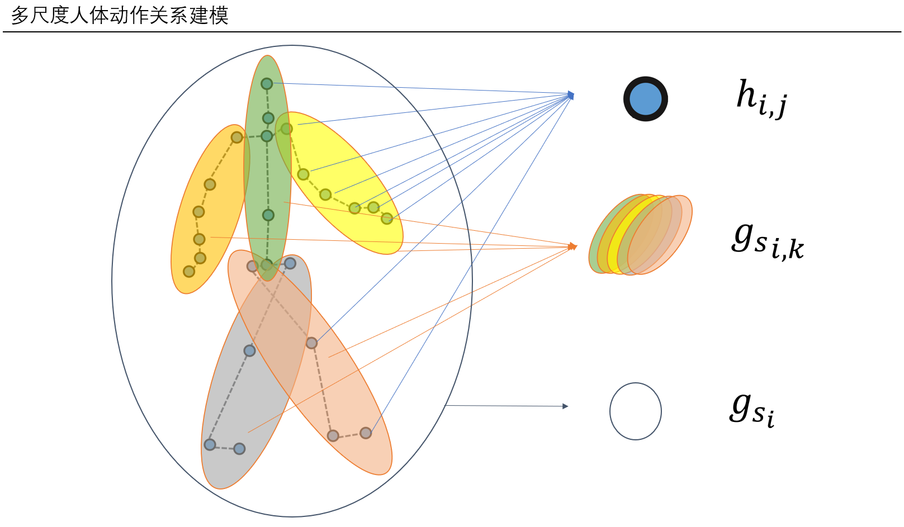
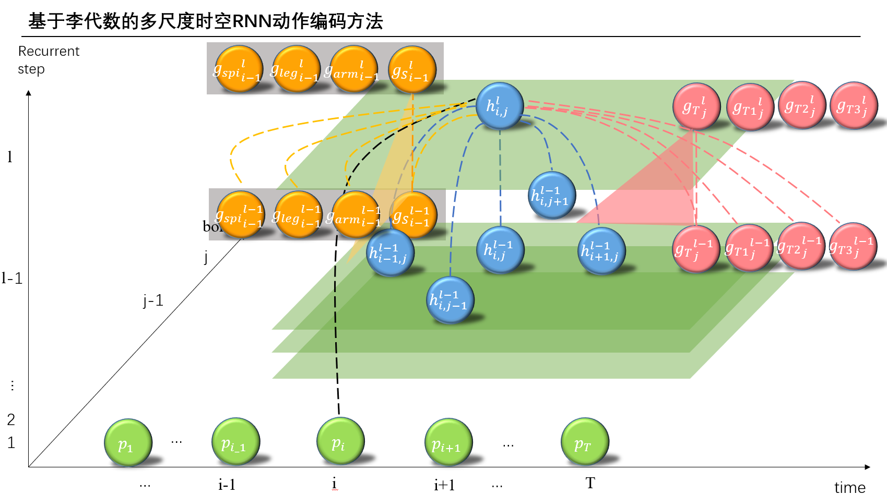
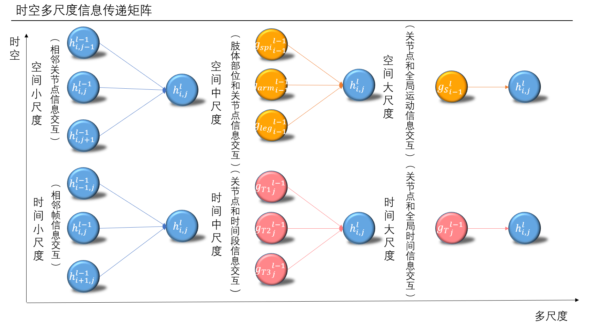

## introduction
This is my research in the project for Dynamic video retrieval.
I try to use a sequence of action data (lie algebra data format) within a action label to predict the following frames.The lesser input frames, the longer prediction frames, and the lower MAE, the better.

Multi-scale Human action relation modeling

Action encoding method

Multi-scale spatio-temporal imfomation exchanging



## usage
### train
```shell script
python train.py --action walk --dataset Human
```
### predict
```shell script
python train.py --dataset Human --training False --visualize False --action walk
```
you can select the actions in the folder './data/h3.6m/Train'
### select a checkpoint to perdict a sequence
change the `checkpoint_dir` & `input_data_dir` in pre_one.py and run pre_one.py
